# Architecture Specification: Merchant Cash-Flow Decision Intelligence System

## 1. System Topology

The Merchant Cash-Flow Decision Intelligence System is designed around a strictly deterministic, evidence-grounded workflow:
**FORECAST → DIAGNOSE → SIMULATE → DECIDE → EXPLAIN**

```mermaid
flowchart TD
    subgraph ClientTier["Client Tier (React 18 + Vite + Recharts)"]
        UI_Overview["Executive KPIs"]
        UI_Forecast["Interactive Forecast & Uncertainty Band"]
        UI_Radar["Risk Radar & Anomalies"]
        UI_Scenario["Scenario Simulator Sliders"]
        UI_Decision["Commitment Decision Center"]
        UI_Copilot["AI Copilot Chat"]
    end

    subgraph APITier["API Gateway Tier (FastAPI /api/v1)"]
        API_Merchants["/merchants"]
        API_Cashflow["/cashflow"]
        API_Forecast["/forecast"]
        API_Anomalies["/anomalies"]
        API_Scenarios["/scenario"]
        API_Decisions["/decision"]
        API_Copilot["/copilot"]
        API_Evaluation["/models/evaluation"]
    end

    subgraph ServiceTier["Domain Service Tier"]
        S_Ledger["CashflowService\n(Realized Inflows/Outflows)"]
        S_Forecast["ForecastService\n(Multi-Step Roll-Forward)"]
        S_Buffer["DynamicBufferEngine\n(Obligations + Burn + Volatility)"]
        S_Anomaly["AnomalyService\n(Z-Score + Isolation Forest)"]
        S_Scenario["ScenarioService\n(What-If Parameter Stressing)"]
        S_Decision["DecisionEngineService\n(Deterministic Verdicts)"]
        S_Evidence["EvidenceEngine\n(Mathematical Facts)"]
        S_Explain["ExplanationService\n(Intent Parser + Templates)"]
    end

    subgraph PersistenceTier["Persistence & ML Tier"]
        DB[(SQLite / PostgreSQL Engine)]
        ModelRegistry["Model Registry & Metadata"]
        FeatureEngine["Feature Engineering Pipeline"]
    end

    ClientTier --> APITier
    APITier --> ServiceTier
    ServiceTier --> PersistenceTier
```

## 2. Core Operational Timing & Ledger Integrity

Traditional bookkeeping calculates `Revenue - Expenses`. In merchant payments, settlement timing is decoupled from transaction timestamps:
1. **Transaction Capture**: A customer makes a payment at time $t$.
2. **Settlement Clearing**: Funds clear on a $T+k$ schedule (e.g. $T+2$ for standard Razorpay settlements) minus payment processing fees and taxes.
3. **Refund Events**: Customer returns debit merchant balances directly or offset future settlement batches.
4. **Cash Balance**:
   $$\text{Ending Cash}_t = \text{Beginning Cash}_t + \text{Settled Inflows}_t - \text{Realized Outflows}_t$$
5. **Projected Cash**:
   $$\text{Projected Cash}_{t+h} = \text{Current Cash} + \sum_{\tau=1}^h \widehat{\text{Inflow}}_{\tau} - \sum_{\tau=1}^h \widehat{\text{Outflow}}_{\tau} - \text{Commitment}_{\tau}$$

## 3. Reliability & Abstention Invariant

To guarantee financial safety, the system implements hard reliability gates:
- **Abstention Gate**: If merchant historical depth $< 14$ days or Data Quality Score $< 50\%$, the system refuses to output `SAFE` or `HIGH_RISK` and instead outputs `INSUFFICIENT_CONFIDENCE`.
- **Grounded AI Constraint**: The LLM never touches, computes, or overrides financial numbers. If the LLM provider fails, deterministic templates produce the full decision artifact seamlessly.
